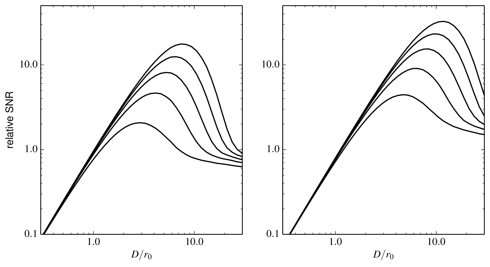

# Practical optical interferometry simulator

This is a framework for simulating the data from a ground-based optical interferometer. It is provided as supplementary material to the book "Practical Optical Interferometry". See the [supplementary material main page](https://dbuscher.github.io/practical-optical-interferometry/) for more information.

## Introduction

The code provides the building blocks to simulate the operation of a multi-telescope interferometer: at present it provides functions to generate simulated atmospheric turbulent wavefront perturbations, do adaptive optics correction of the turbulence and combine beams from an arbitrary number of telescopes, with or without spatial filtering. This code is derived from the code which was used to provide data for many of the figures in the book.

The model for the interferometer is relatively abstract and general-purpose, but is designed so that it can be extended to include details such as fringe-tracking, detection noise and so forth. A functional-programming style has been adopted in order to try and make it as modular and extensible as possible. 

## Requirements
The simulator runs under Python3 with Numpy > 1.7.0.

## Installation
Download (for example using the "download as ZIP file" link on the right hand side of the page) and unpack a copy of this repository. The module "poisimulator" can be copied to the Python path and then imported using
```python
import poisimulator
```
Example code using the modules is in the `examples/` directory.
